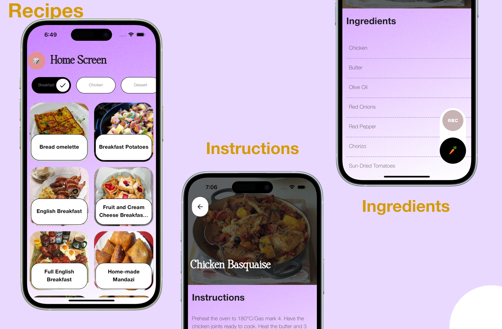

# Recipes

#### Video Demo:  <https://youtu.be/7yOq--PnGiM>

#### Description:

Recipes App is a mobile app designed to make cooking easier and more enjoyable. With this app, we can find various delicious recipes, view detailed cooking instructions, and easily switch to a list of ingredients needed for each dish.

I love creating mobile apps, but having to create an app with two codebases isn't fun at all (at least for me). That's why Flutter is my go-to language for this project as my project is simple and no need for more complex features. It is a fun and simple project for me and a useful project as I love cooking in my free time. I designed the app UI in Figma.
Here is a brief structure of my project and how I created the app using MVVM.

### API for Meals
[TheMealDB](https://www.themealdb.com/)

### View
As for the App UI, There are only two screens. One is the screen for the home page which showcases all menus and the detail page which shows instructions and ingredients for how to prepare a certain recipe. pages are placed inside the "pages" folder and grouped with their relative child components. 

Inside the pages folder, there are two folders named Home and detail representing app screens. 
- Each folder contains home_page.dart and detail_page.dart (main UI screens file) and widgets folders. (for extracting and cleaning code). 
- Inside home/widgets, meal_item.dart for building recipe item UI in home grid view. 
- Inside detail/widgets, there are four files including
- instruction_page.dart for showing how to prepare the dishes,
- ingredients_page.dart for showing ingredients content
- ingredients_tile.dart for building the UI of ingredients items, 
- And finally, content_page.dart for deciding which options to show.

### ViewModel
I used global state management (provider in Flutter) to handle all my business logic separated from my UI. thus making the app easier to debug. 

There are three files used for state management. 
- base_provider.dart is the provider used as a parent class for providers.
- home_page_provider.dart, and detail_page_provider.dart extends the base file and serves as the states of respective screens.

### Model
All my models (classes) for handling data and converting JSON from API calls to my custom objects.
- response_model.dart handles two cases. Success model and Failure model. network_manager.dart used this file to return the result to providers based on network request result, and providers used this model for checking network request was a success or failure.
- category_model.dart handles the data returned from category list API and converts from JSON to dart object.
- meal_list_model.dart handles the data returned from the meals list API and converts from JSON to dart object.
- meal_detail_model.dart handles the data returned from meal detail API and converts from JSON to dart object.
- ingredient_model.dart handles the data class relating to ingredients and is used in providers and other models for ingredient-related items.

That's it. That's the core layer of my app. It is simple as that is.

## Making app looks good
### styles
For sharing styles across the apps, without repeating again and again and consistent App UI.
- main_app_style.dart stores styles that will not change throughout the app lifecycle, like icons, padding, and spacing.
- colors.dart defines the colors outside of the flutter build-in color system For custom hex colors.

### widgets
Custom widgets that can be used by the pages inside apps like buttons and appbars.

- appbar.dart creates a custom app bar that can be used on any screen of the app.
- app_buttons.dart groups all button widgets that are used inside the app. Currently, two buttons are added to the group, namely CircleBtn for the randomize button in the home screen and backBtn for navigating back from the detail screen to the home screen.
- background_widget.dart creates a custom gradient background used in the screens. it used image as background image and rendered behind screen contents.
- choice_widget.dart is responsible for creating a category choice button with animation.
- widget in color_overlay.dart creates a fade-out effect in any widgets it wraps.
- dotted_border.dart creates a dotted line under ingredients and uses inside ingredient_tile.dart. 
- fab_btn.dart creates a cute button at the bottom right corner of the detail screen for toggling instructions and ingredients.
- loading_widgets.dart groups all loading widgets used inside the app. Currently, only one loading widget exists and is used in the home screen and detail screen while fetching API requests.

### animations
Animations widgets for reusable animation throughout the app.
There are two animation files for this app. 
- opacity_animation.dart for building animation with fade in effect and 
- scale_animation.dart for on-click bounce effect.

### Extensions and networks
Extensions files for build-in class and config files for network calls.
- str_extension.dart file adds the functionality of capitalizing letters to the built-in string class.
- network_manager.dart file handles all the API requests and can only be accepted with a singleton provided by the class itself. ViewModel (provider) will call this file and create network requests.

---

And that's it. Thank you so much for reading. Happy coding and this is CS50.
